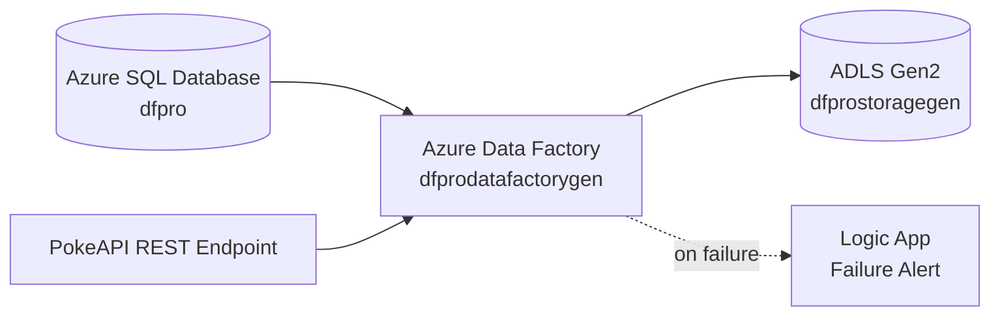
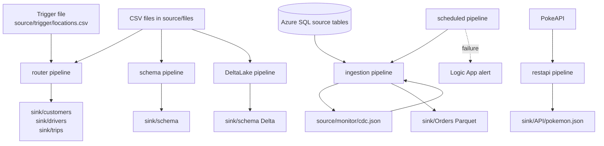
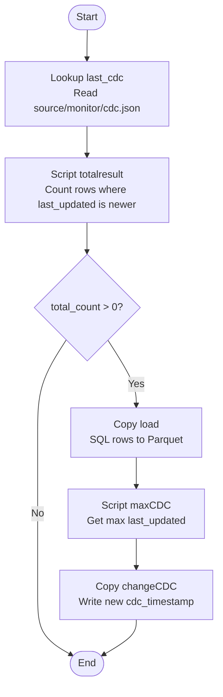
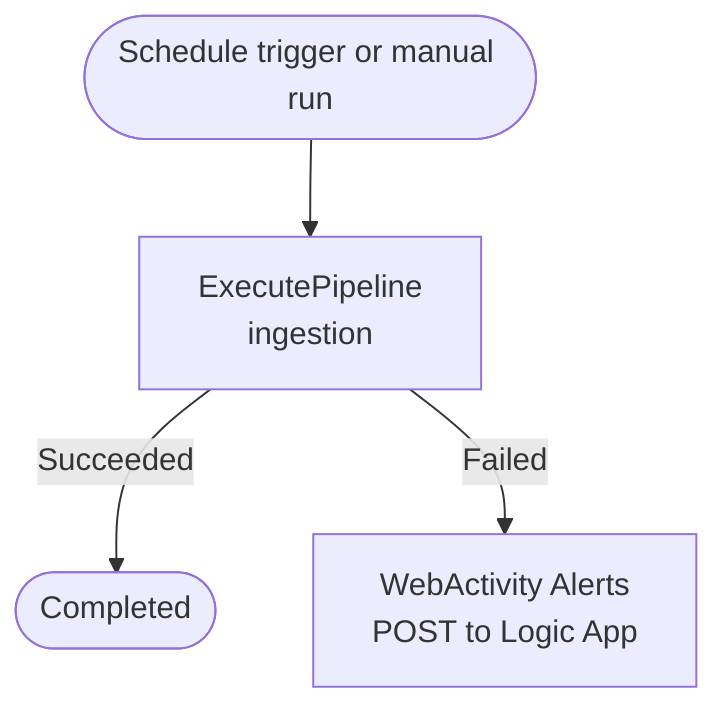
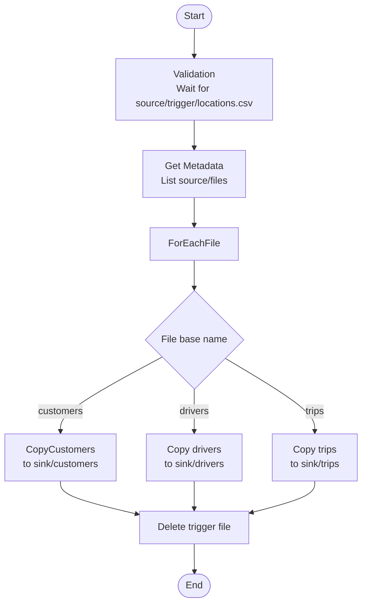
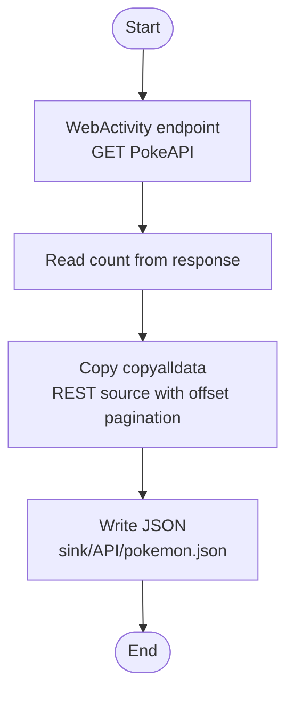

# ADF_Pro

Azure Data Factory course project for building common data engineering patterns on Microsoft Azure: file ingestion, metadata-driven copy, incremental SQL extraction, REST API ingestion, scheduling, failure alerting, and Delta Lake upserts.

## Project Overview

This repository contains the Azure Data Factory artifacts for the factory `dfprodatafactorygen`, deployed in the `centralindia` region.

The solution connects three main systems:

- Azure SQL Database: relational source system for incremental ingestion.
- Azure Data Lake Storage Gen2: source, sink, monitoring, schema, API, and Delta storage zones.
- REST API: PokeAPI endpoint used to demonstrate API pagination and landing JSON data in the lake.



## Repository Structure

```text
ADF_Pro/
|-- dataflow/
|   `-- dataflow.json
|-- dataset/
|   |-- ds_api.json
|   |-- ds_cdc.json
|   |-- ds_csv_dynamic.json
|   |-- ds_emptyJSON.json
|   |-- ds_metadata.json
|   |-- ds_parquet.json
|   |-- ds_rest.json
|   `-- ls_database.json
|-- factory/
|   `-- dfprodatafactorygen.json
|-- linkedService/
|   |-- ls_REST.json
|   |-- ls_database.json
|   `-- lsdatalake.json
|-- pipeline/
|   |-- DeltaLake.json
|   |-- ingestion.json
|   |-- newpipeline.json
|   |-- restapi.json
|   |-- router.json
|   |-- scheduled.json
|   `-- schema.json
|-- trigger/
|   `-- schedule.json
|-- publish_config.json
`-- README.md
```

## Azure Resources

### Data Factory

| Artifact | Value |
| --- | --- |
| Factory name | `dfprodatafactorygen` |
| Region | `centralindia` |
| Identity | System-assigned managed identity |

### Linked Services

| Linked service | Type | Purpose |
| --- | --- | --- |
| `ls_database` | Azure SQL Database | Connects to the `dfpro` database on `dfprodatabasegen.database.windows.net`. |
| `lsdatalake` | Azure BlobFS / ADLS Gen2 | Connects to `https://dfprostoragegen.dfs.core.windows.net/`. |
| `ls_REST` | REST service | Connects to `https://pokeapi.co/api/v2/pokemon`. |

## Storage Layout

The pipelines use these logical ADLS areas:

| Container | Folder/File | Used by | Purpose |
| --- | --- | --- | --- |
| `source` | `files/` | `router`, `schema` | Incoming CSV files such as customers, drivers, and trips. |
| `source` | `trigger/locations.csv` | `router` | Trigger/control file used by validation before routing. |
| `source` | `monitor/cdc.json` | `ingestion` | Stores the last processed CDC timestamp. |
| `source` | `monitor/empty.json` | `ingestion` | Helper JSON used when writing the updated CDC marker. |
| `source` | `DeltaSource/locations.csv` | `DeltaLake` | Source file for the Delta data flow. |
| `sink` | `Orders/` | `ingestion` | Parquet output for incremental SQL loads. |
| `sink` | `customers/`, `drivers/`, `trips/` | `router` | Routed CSV outputs by entity type. |
| `sink` | `schema/` | `schema`, `DeltaLake` | Schema-mapped CSV outputs and Delta sink path. |
| `sink` | `API/pokemon.json` | `restapi` | JSON output from PokeAPI ingestion. |

## Datasets

| Dataset | Type | Linked service | Description |
| --- | --- | --- | --- |
| `ds_csv_dynamic` | DelimitedText | `lsdatalake` | Reusable CSV dataset with parameters for container, folder, and file. |
| `ds_metadata` | DelimitedText | `lsdatalake` | Reads file metadata from `source/files`. |
| `ls_database` | AzureSqlTable | `ls_database` | Generic SQL table dataset. |
| `ds_parquet` | Parquet | `lsdatalake` | Writes Snappy-compressed Parquet files to `sink/Orders`. |
| `ds_cdc` | Json | `lsdatalake` | Reads and writes the CDC timestamp in `source/monitor/cdc.json`. |
| `ds_emptyJSON` | Json | `lsdatalake` | Empty JSON helper file used to generate updated CDC output. |
| `ds_rest` | RestResource | `ls_REST` | REST source dataset with a dynamic offset query parameter. |
| `ds_api` | Json | `lsdatalake` | Writes Pokemon API response data to `sink/API/pokemon.json`. |

## Pipeline Summary

| Pipeline | Main pattern | Description |
| --- | --- | --- |
| `ingestion` | Incremental ingestion / CDC | Loads only changed rows from Azure SQL to ADLS Parquet and updates the CDC timestamp. |
| `scheduled` | Orchestration and alerting | Runs `ingestion` and calls a Logic App if ingestion fails. |
| `router` | File validation and routing | Waits for a trigger file, routes input CSV files by file name, then deletes the trigger file. |
| `schema` | Metadata-driven schema mapping | Iterates files and applies entity-specific tabular translators. |
| `restapi` | REST API ingestion | Calls PokeAPI, paginates through results, and writes JSON to ADLS. |
| `DeltaLake` | Mapping data flow | Runs a data flow that transforms location data and upserts into Delta format. |
| `newpipeline` | Demo/test pipeline | Contains a simple wait activity. |

## End-to-End Flow



## Incremental SQL Ingestion Flow

Pipeline: `ingestion`

This pipeline demonstrates a CDC-style pattern using a stored timestamp in ADLS.

Parameters:

| Parameter | Default | Purpose |
| --- | --- | --- |
| `schema` | `source` | SQL schema to read from. |
| `table` | `Orders` | SQL table to read from. |
| `backdate` | `2025-09-24` | Optional override timestamp for reprocessing older data. |

Flow:



SQL filter logic:

```sql
where last_updated > '<backdate or last cdc timestamp>'
```

Output:

- Changed records are written to `sink/Orders` as Parquet.
- The latest `last_updated` value is written back to `source/monitor/cdc.json`.

## Scheduled Orchestration and Alerting

Pipeline: `scheduled`

This pipeline wraps the incremental ingestion pipeline and adds failure alerting.



The schedule trigger `schedule` is configured to run hourly starting at `2026-06-25T11:33:00` India Standard Time, but its current `runtimeState` is `Stopped`.

## File Router Flow

Pipeline: `router`

This pipeline demonstrates event/control-file style processing.

Flow:



Routing behavior:

| Input file name | Sink folder |
| --- | --- |
| `customers.csv` | `sink/customers` |
| `drivers.csv` | `sink/drivers` |
| `trips.csv` | `sink/trips` |

## Schema Mapping Flow

Pipeline: `schema`

This pipeline reads files from `source/files`, loops through each file, and applies a different tabular translator based on file name.

```mermaid
flowchart TD
    Start([Start])
    Metadata[Get Metadata<br/>List source/files]
    Loop[ForEachFile]
    Choose{item().name}
    CustomerSchema[customers_schema]
    DriverSchema[drivers_schema]
    TripsSchema[trips_schema]
    Copy[Copy DataLoad<br/>to sink/schema]
    End([End])

    Start --> Metadata --> Loop --> Choose
    Choose -- customers.csv --> CustomerSchema --> Copy
    Choose -- drivers.csv --> DriverSchema --> Copy
    Choose -- other/trips --> TripsSchema --> Copy
    Copy --> End
```

Schema mappings included:

- Customer fields such as `customer_id`, `first_name`, `last_name`, `email`, `phone_number`, `city`, `signup_date`, and `last_updated_timestamp`.
- Driver fields such as `driver_id`, `first_name`, `last_name`, `phone_number`, `vehicle_id`, `driver_rating`, `city`, and `last_updated_timestamp`.
- Trip fields such as `trip_id`, `driver_id`, `customer_id`, `vehicle_id`, trip times, locations, distance, fare, payment method, status, and `last_updated_timestamp`.

Note: The `trips_schema` parameter is currently stored as a JSON string and appears incomplete in the exported artifact. Review it before relying on this pipeline in production.

## REST API Ingestion Flow

Pipeline: `restapi`

This pipeline demonstrates API ingestion with pagination.



Pagination rule:

```text
QueryParameters.offset = RANGE:0:@{activity('endpoint').output.count}:20
```

This means the copy activity loops through Pokemon API results in pages of 20 until it reaches the API-reported total count.

## Delta Lake Data Flow

Pipeline: `DeltaLake`

Data flow: `dataflow`

The `DeltaLake` pipeline executes a mapping data flow using 8 general compute cores.

```mermaid
flowchart TD
    Source[Source CSV<br/>source/DeltaSource/locations.csv]
    Upper[Derived Column<br/>state = upper(state)]
    Select[Select columns<br/>location_id, city, state, country, last_updated_timestamp]
    Alter[Alter Row<br/>upsertIf(1 == 1)]
    DeltaSink[Delta sink<br/>sink/schema<br/>key: location_id]

    Source --> Upper --> Select --> Alter --> DeltaSink
```

The data flow reads location data with this source shape:

| Column | Type |
| --- | --- |
| `location_id` | short |
| `city` | string |
| `state` | string |
| `country` | string |
| `latitude` | double |
| `longitude` | double |
| `last_updated_timestamp` | timestamp |

Transformations:

- Converts `state` to uppercase.
- Selects a smaller set of columns.
- Marks every row for upsert.
- Writes Delta format to `sink/schema`.
- Uses `location_id` as the upsert key.

## Trigger

| Trigger | Type | Pipeline | Schedule | Current state |
| --- | --- | --- | --- | --- |
| `schedule` | ScheduleTrigger | `scheduled` | Every 1 hour from `2026-06-25T11:33:00` IST | `Stopped` |

Trigger parameters:

| Parameter | Value |
| --- | --- |
| `schema` | `source` |
| `table` | `Orders` |

## Operational Notes

- The hourly trigger is currently stopped. Start it in Azure Data Factory if scheduled ingestion should run automatically.
- The `scheduled` pipeline contains a Logic App callback URL with a signature token. In a real project, avoid committing signed URLs or secrets directly to source control.
- The SQL and ADLS linked services use encrypted credentials in the exported ADF artifacts.
- The `schema` pipeline should be checked before production use because `trips_schema` appears malformed or truncated.
- The failure alert body in `scheduled` should be reviewed to ensure it sends valid JSON to the Logic App.

## Recommended Execution Order for Learning

1. Run `router` to understand validation, metadata listing, switch routing, and delete activity.
2. Run `schema` to understand dynamic datasets and schema mapping.
3. Run `ingestion` manually with a known `schema`, `table`, and `backdate`.
4. Run `scheduled` to test orchestration and failure alerting.
5. Run `restapi` to test REST pagination into ADLS.
6. Run `DeltaLake` to test mapping data flows and Delta upserts.

## Current Build Status

The repository is a working ADF course project with multiple common data engineering patterns represented. A few exported artifacts need cleanup before the project is treated as production-ready, especially secret handling, alert body formatting, and the `trips_schema` mapping.
